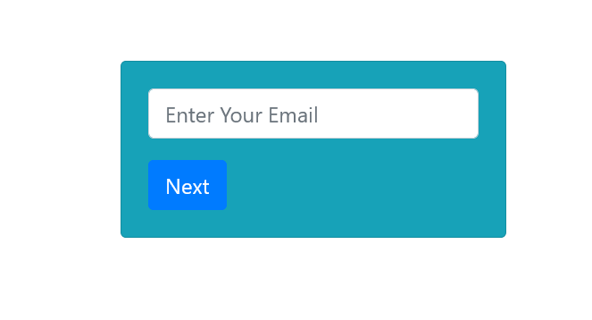
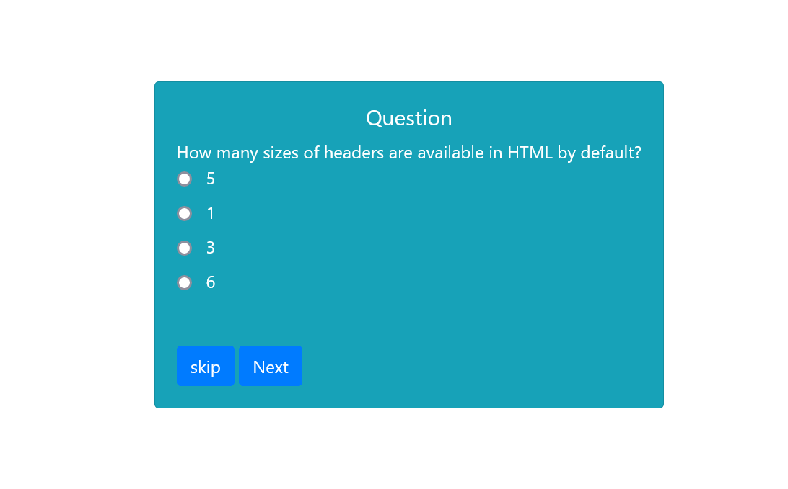
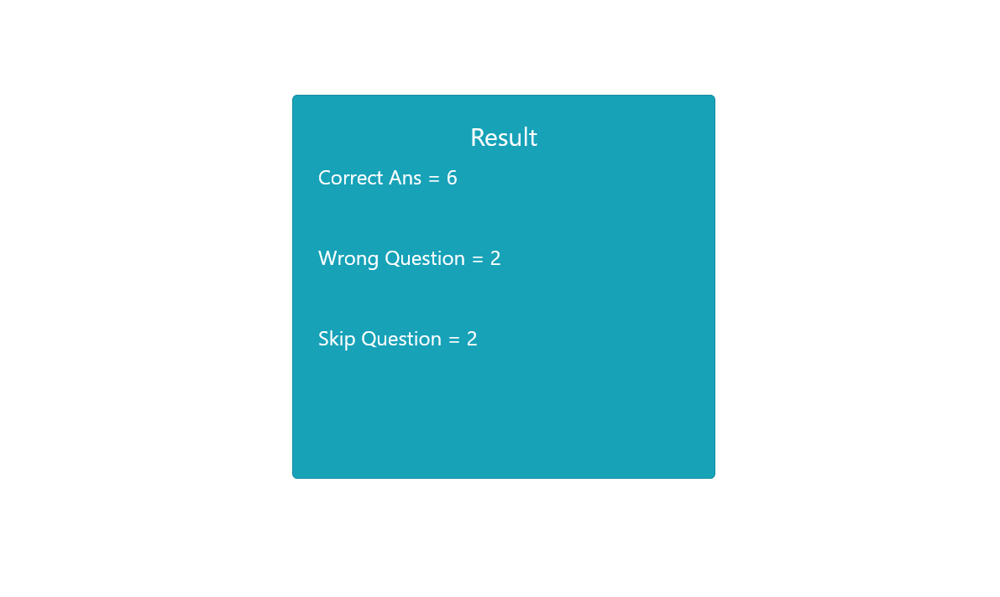

## Multiple Choice Application

Table of Contents
Installation
Usage
Database Setup
Model Creation
Controller Creation
Routes Configuration
View Creation
Form Handling
Processing User Answers
Displaying Results
Styling and Front-end Enhancements
Installation
Clone the repository:

bash
Copy code
git clone https://github.com/shahzad-ishaq/Multiple-Choice-Questions-PHP--.git
Install dependencies:

bash
Copy code
composer install
Create a .env file by copying the .env.example and configuring it with your database credentials.

Generate an application key:

bash
Copy code
php artisan key:generate
Migrate the database:

bash
Copy code
php artisan migrate
Seed the database (optional, for demo data):

Usage
Start the development server:

bash
Copy code
php artisan serve
Visit http://localhost:8000 in your browser.

Register a new user or log in with existing credentials.

Complete the multiple choice tasks.

Database Setup
Define a database table to store the questions, options, and correct answers.

Create a migration using php artisan make:migration.

This README file provides an outline for documenting your multiple choice task application. Make sure to customize it based on the specifics of your project.
